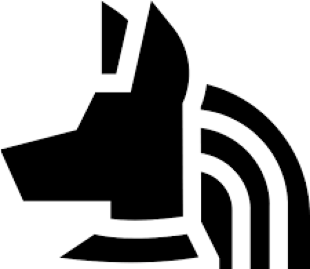
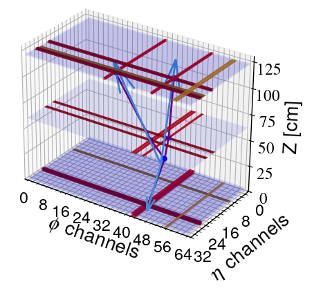
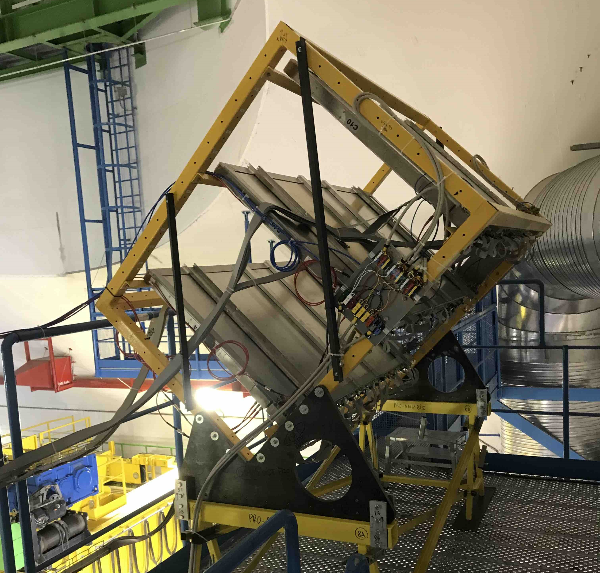

  <h1 style="display: inline;">proAnubis Data Analysis System</h1>
  

The Standard Model is one of the most accurate scientific theories ever devised and has passed decades of experimental tests. Yet, there are many fundamental questions that can not be answered without physics beyond the Standard Model (BSM). This includes the nature of dark matter, neutrino masses, the origin of the
matter-antimatter asymmetry, a theory of quantum gravity, and the puzzling unnaturalness of the electroweak scale. Many proposed theoretical scenarios that address these questions predict particles with long lifetimes on
the scale of typical collider experiments. In recent years, a number of dedicated experiments have been proposed to search for such long-lived particles (LLPs) with
cτ > 5 m, where τ denotes the mean proper lifetime.

ANUBIS is a project with a goal of discovering these particles by placing Resistive Plate Chambers over the ceiling of the ATLAS cavern. Given its high sensitivity and low cost it is one of the most promising projects with of its kind. The prototype proANUBIS is currently installed in CERN and serves as a proof-of-concept for the proposal. 

The code in this repo is set of analysis tools used in proANUBIS, including:
- Track Reconstruction Algorithm
- Vertex Detector
- Alignment metrics calculations
- ATLAS alignment foundation
- High Voltage analysis
- Channel, time, RPC and many more histograms
- Visualisation tools

  
  

Here is a list of papers with our involvement:

- [M. Bauer, Oleg Brandt, Lawrence Lee, Christian Ohm, **ANUBIS: Proposal to search for long-lived neutral particles in CERN service shafts**, arXiv:1909.13022](https://arxiv.org/abs/1909.13022)
- [**Part III students reports** here](https://cernbox.cern.ch/pdf-viewer/public/w5oOfxCSxdOUFgj/pac74_100_Report_v7.pdf?contextRouteName=files-public-link&contextRouteParams.driveAliasAndItem=public%2Fw5oOfxCSxdOUFgj&items-per-page=100)[ **and** here](https://cernbox.cern.ch/pdf-viewer/public/KR0jD8HDFaQvWaS/yw544_100_Report_v7.pdf?contextRouteName=files-public-link&contextRouteParams.driveAliasAndItem=public%2FKR0jD8HDFaQvWaS&items-per-page=100)

Proceedings:

- [A. Shah [ANUBIS collaboration], **Installation of proANUBIS – a proof-of-concept demonstrator for the ANUBIS experiment**, PoS (LHCP2023)168](https://pos.sissa.it/444/168/)
- [**ANUBIS Experiment TWiki**](https://twiki.cern.ch/twiki/bin/view/ANUBIS/)
